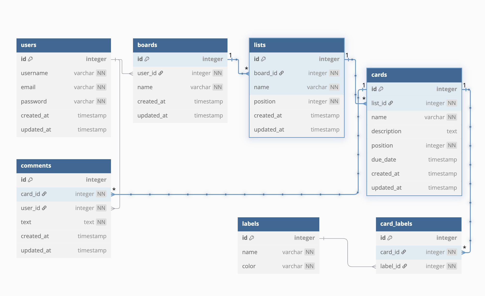

<html style="margin:10px">
## API Documentation

---

## Datbase Schema Design

<div style="page-break-after: always; visibility: hidden">
\pagebreak
</div>

## USER AUTHENTICATION/AUTHORIZATION
### All endpoints that require authentication
All endpoints that require a current user to be logged in.

* Request: endpoints that require authentication
* Error Response: Requore authentication
    * Status Code: 401
    * Headers:
        * Content-Type: application/json
    * Body:

```json
{
"message": "Authentication required"
}
```
***
### All endpoints that require authorization

All endpoints that reuire authentication and the current user does not have the correct role(s) or permission(s).

* Request: endpoints that require proper authorization
* Error Response: Require proper authorization
    * Status Code: 403
    * Headers:
        * Content-Type: application/json
    * Body:
```json
{
"message": "Forbidden"
}
```
<div style="page-break-after: always; visibility: hidden">
\pagebreak
</div>

### Get the Current User
Returns the information about the current user that is logged in.

* Require Authentication: false
* Request
    * Method: GET
    * Route path: /api/auth
    * Body: none

* Successful Response (user logged in):
    * Status Code: 200
    * Headers:
        * Content-Type: application/json
    * Body:
```json
{
"user": {
    "id": 1,
    "email": "john.smith@gmail.com",
    "username": "JohnSmith"
    }
}
```

* Successful Response (no user logged in):
    * Status Code: 200
    * Headers:
        * Content-Type: application/json
    * Body:
```json
{
"user": null
}
```
***
### Log In a User
Logs in a current user with valid credentials and returns the current user's information.
* Require Authentication: false
* Request
    * Method: POST
    * Route path: /api/auth/login
    * Headers:
        * Content-Type: application/json
    * Body:
```json
{
"credential": "john.smith@gmail.com",
"password": "secret password"
}
```
* Successful Response:
    * Status Code: 200
    * Headers:
    * Content-Type: application/json
    * Body:
```json
{
"user": {
    "id": 1,
    "email": "john.smith@gmail.com",
    "username": "JohnSmith"
}
}
```
* Error Response (Invalid credentials):
    * Status Code: 401
    * Headers:
    * Content-Type: application/json
    * Body:
```json
{
"message": "Invalid credentials"
}
```
* Error Response (Validation errors):
    * Status Code: 400
    * Headers:
        * Content-Type: application/json
    * Body:
```json
{
"message": "Bad Request",
"errors": {
    "credential": "Email or username is required",
    "password": "Password is required"
} }
```
***
### Sign Up a User
Creates a new user, logs them in as the current user, and returns the current user's information.

* Require Authentication: false
* Request
    * Method: POST
    * Route path: /api/auth/signup
    * Headers:
        * Content-Type: application/json
    * Body:
```json
{
"email": "john.smith@gmail.com",
"username": "JohnSmith",
"password": "secret password"
}
```

* Successful Response:
  * Status Code: 201
  * Headers:
    * Content-Type: application/json
  * Body:

```json
{
"user": {
    "id": 1,
    "email": "john.smith@gmail.com",
    "username": "JohnSmith"
}
}
```

* Error Response (User already exists):
    * Status Code: 500
    * Headers:
        * Content-Type: application/json
    * Body:

```json
{
"message": "User already exists",
"errors": {
    "email": "User with that email already exists",
    "username": "User with that username already exists"
}
}
```

* Error Response (Validation errors):
    * Status Code: 400
    * Headers:
        * Content-Type: application/json
    * Body:

```json
{
"message": "Bad Request",
"errors": {
    "email": "Invalid email",
    "username": "Username is required"
}
}
```
***

### Log out a user

* Require Authentication: true
* Request
    * Method: DELETE
    * Route path: /api/auth/logout
    * Body: none

* Successful Response:
    * Status Code: 200
    * Headers:
        * Content-Type: application/json
    * Body:

```json
{
"message": "User logged out successfully"
}
```
<!--
***
 Don't currently have a route
### Update a User
Updates the current user's information and returns the update user information

* Require Authentication: true
* Request
    * Method: PUT
    * Route path: /api/users/:userId
    * Body:

```json
    {
    "email": "updated.email@gmail.com",
    "username": "UpdatedUsername"
    }
```

* Successful Response:
    * Status Code: 200
    * Headers:
        * Content-Type: application/json
    * Body:

```json
{
"id": 1,
"email": "updated.email@gmail.com",
"username": "UpdatedUsername"
}
```
-->

<div style="page-break-after: always; visibility: hidden">
\pagebreak
</div>

## BOARDS

### Get all Boards
Get all the boards that belongs to the current user.

* Require Authentication: true
* Request
    * Method: GET
    * Route path: /api/boards
    * Body: none

* Successful Response:
    * Status Code: 200
    * Headers:
        * Content-Type: application/json
    * Body:
```json
{
"boards": [
    {
    "id": 1,
    "user_id": 1,
    "name": "My Project Board",
    "created_at": "2025-04-06T20:00:00Z",
    "updated_at": "2025-04-07T12:00:00Z"
    }
]
}
```
***
### Get board by specific id
Get board by return id.

* Require Authentication: true
* Request
    * Method: GET
    * Route path: /api/boards/:board_id
    * Body: none

* Successful Response:
    * Status Code: 200
    * Headers:
        * Content-Type: application/json
    * Body:
```json
{
"boards": [
    {
    "id": 1,
    "user_id": 1,
    "name": "My Project Board",
    "created_at": "2025-04-06T20:00:00Z",
    "updated_at": "2025-04-07T12:00:00Z"
    }
]
}
```
***
### Create a Board
Creates and returns a new board

* Require Authentication: true
* Request
    * Method: POST
    * Route path: /api/boards
    * Headers:
        * Content-Type: application/json
    * Body:

```json
{
"name": "New Board"
}
```

* Successful Response:
    * Status Code: 201
    * Headers:
        * Content-Type: application/json
    * Body:

```json
{
"id": 2,
"user_id": 1,
"name": "New Board",
"created_at": "2025-04-07T14:00:00Z",
"updated_at": "2025-04-07T14:00:00Z"
}
```
***
### Delete a Board
Delets an exisitn board

* Require Authentication: true
* Require proper authorization: Board must belong to current user
* Request
    * Method: DELETE
    * Route path: /api/boards/:boardId
    * Body: none


* Successful Response:
    * Status code: 200
    * Headers:
        * Content
    * Body:

```json
{
"message": "Board deleted successfully"
}
```

* Error response: Couldn't find a Board with the specified id
    * Status Code: 404
    * Headers:
        * Content-Type: application/json
    * Body:
```json
{
"message": "Board not found"
}
```
***
### Update a Board
Updates and returns an existing board.

* Require Authentication: true
* Require proper authorization: Board must belong to current user
* Request
    * Method: PUT
    * Route path: /api/boards/:boardId
    * Headers:
        * Content-Type: application/json
    * Body:

```json
{
"name": "Updated Board Name"
}
```

* Successful Response:
    * Status Code: 200
    * Headers:
        * Content-Type: application/json
    * Body:

```json
{
"id": 1,
"user_id": 1,
"name": "Updated Board Name",
"created_at": "2025-04-06T20:00:00Z",
"updated_at": "2025-04-07T15:00:00Z"
}
```
* Error response: Couldn't find a Board with the specified id
    * Status Code: 404
    * Headers:
        * Content-Type: application/json
    * Body:
```json
{
"error": "Board not found"
}
```

<div style="page-break-after: always; visibility: hidden">
\pagebreak
</div>

## LISTS
### Get Lists for a Board
Returns all the lists that belong to a specified board
* Require Authentication: true
* Request
    * Method: GET
    * Route path: /api/boards/:boardId/lists
    * Header:
        * Content-Type: application/json
    * Body: none

* Successful Response:
    * Status code: 200
    * Headers:
        * Content-Type: application/json
    * Body:

```json
    {
    "lists": [
        {
        "id": 1,
        "board_id": 1,
        "name": "To Do",
        "position": 1,
        "created_at": "2025-04-07T10:00:00Z",
        "updated_at": "2025-04-07T10:00:00Z"
        }
    ]
    }
```
***
### Create a List in a Board
Create and return a list on a specific board

* Require Authentication: true
* Request
    * Method: POST
    * Route path: /api/boards/:boardId/lists
    * Headers:
        * Content-Type: application/json
    * Body:

```json
{
"name": "In Progress",
"position": 2
}
```

* Successful Response:
    * Status code: 200
    * Headers:
        * Content-Type: application/json
    Body:

```json
{
"id": 2,
"board_id": 1,
"name": "In Progress",
"position": 2,
"created_at": "2025-04-07T11:00:00Z",
"updated_at": "2025-04-07T11:00:00Z"
}
```
***
### Delete a List
Delete an exisiting list.

* Require Authentication: true
* Request
    * Method: DELETE
    * Route path: /api/lists/:listId
    * Body: none

* Successful Response:
    * Status code: 200
    * Headers:
        * Content-Type: application/json
    * Body:
```json
{
"message": "List deleted successfully"
}
```
***
### Update a List
Updates and returns an existing list.

* Require Authentication: true
* Request
    * Method: PUT
    * Route path: /api/lists/:listId
    * Headers:
        * Content-Type: application/json
    * Body:
```json
{
"name": "Updated List Name",
"position": 1
}
```

* Successful Response:
    * Status code: 200
    * Headers:
        * Content-Type: application/json
    * Body:
```json
{
"id": 1,
"board_id": 1,
"name": "Updated List Name",
"position": 1,
"created_at": "2025-04-07T10:00:00Z",
"updated_at": "2025-04-07T15:00:00Z"
}
```

<div style="page-break-after: always; visibility: hidden">
\pagebreak
</div>

## CARDS
---
### Get Cards for a List
Returns cards belonging to a specific list

* Require Authentication: true
* Request
    * Method: GET
    * Route path: /api/lists/:listId/cards
    * Headers:
        * Content-Type: application/json
    * Body: none

* Successful Response:
    * Status code: 200
    * Headers:
        * Content-Type: application/json
    * Body:
```json
{
"cards": [
    {
    "id": 1,
    "list_id": 1,
    "name": "Write API docs",
    "description": "Document all API endpoints",
    "position": 1,
    "due_date": "2025-04-08",
    "createdAt": "2025-04-07T12:00:00Z",
    "updatedAt": "2025-04-07T12:00:00Z"
    }
]
}
```
* Error Response: Cards not found
    * Status code: 404
    * Headers:
        * Content-Type: application/json
    * Body:
        ```json
        {
            "error": "Cards not found"
        }
        ```
---
### Create a Card in a List
Creates and returns a new card on specified list

* Require Authentication: true
* Request
    * Method: POST
    * Route path: /api/lists/:listId/cards
    * Headers:
        * Content-Type: application/json
    * Body:
```json
{
"name": "Write API docs",
"description": "Document all endpoints",
"position": 1,
"due_date": "2025-04-08"
}
```

* Successful Response:
    * Status code: 201
    * Headers:
        * Content-Type: application/json
    * Body:
```json
{
"id": 1,
"list_id": 1,
"name": "Write API docs",
"description": "Document all endpoints",
"position": 1,
"due_date": "2025-04-08",
"createdAt": "2025-04-07T12:00:00Z",
"updatedAt": "2025-04-07T12:00:00Z"
}
```
***

### Delete a Card
Delete an existing car

* Require Authentication: true
* Request
    * Method: DELETE
    * Route path: /api/cards/:cardId
    * Headers:
        * Content-Type: application/json
    * Body: none

* Successful Response:
    * Status code: 200
    * Headers:
        * Content-Type: application/json
    * Body:
        ```json
        {
        "message": "Card deleted successfully"
        }
        ```
***
### Update a Card
Update and returns an existing card

* Require Authentication: true
* Request
    * Method: PUT
    * Route path: /api/cards/:cardId
    * Headers:
        * Conetent-Type: application/json
    * Body:
```json
{
"name": "Updated Card Name",
"description": "Updated description",
"position": 2,
"due_date": "2025-04-09"
}
```

* Successful Response:
    * Status code: 200
    * Headers:
        * Content-Type: application/json
    * Body:
```json
{
"id": 1,
"list_id": 1,
"name": "Updated Card Name",
"description": "Updated description",
"position": 2,
"due_date": "2025-04-09",
"createdAt": "2025-04-07T12:00:00Z",
"updatedAt": "2025-04-07T16:00:00Z"
}
```
<div style="page-break-after: always; visibility: hidden">
\pagebreak
</div>


## COMMENTS

### Get Comments for a Card
Return all the comments for a card

* Require Authentication: true
* Request
    * Method: GET
    * Route path: /api/cards/:cardId/comments
    * Headers:
        * Content-Type: application/json

* Successful Response:
    * Status code: 200
    * Headers:
      * Content-Type: application/json
    * Body:

```json
{
"comments": [
    {
    "id": 1,
    "card_id": 1,
    "user_id": 1,
    "text": "Remember to include error examples",
    "createdAt": "2025-04-07T13:00:00Z",
    "updatedAt": "2025-04-07T13:00:00Z"
    }
]
}
```

### Create a Comment on a Card
Create a comment on an existing Card

* Require Authentication: true
* Request
    * Method: POST
    * Route path: /api/cards/:cardId/comments
    * Headers:
        * Content-Type: application/json
    * Body:

```json
{
  "text": "Remember to include error examples"
}
```

* Successful Response:
    * Status code: 200
    * Headers:
        * Content-Type: application/json
    * Body:

```json
{
  "id": 1,
  "card_id": 1,
  "user_id": 1,
  "content": "Remember to include error examples",
  "createdAt": "2025-04-07T13:00:00Z",
  "updatedAt": "2025-04-07T13:00:00Z"
}
```

### Delete a Comment
Delete an existing comment

* Require Authentication: true
* Request
    * Method: DELETE
    * Route path: /api/comments/:commentId
    * Headers:
        * Content-Type: application/json
    * Body: none

* Successful Response:
    * Status code: 200
    * Headers:
        * Content-Type: application/json
    * Body:

```json
{
  "message": "Comment deleted successfully"
}
```

### Update a Comment
Update and return an existing comment

* Require Authentication: true
* Request
    * Method: PUT
    * Route path: /api/comments/:commentId
    * Headers:
        * Conetent-Type: application/json
    * Body:

```json
{
  "text": "Updated comment text"
}
```

* Successful Response:
    * Status code: 201
    * Headers:
        * Content-Type

```json
{
  "id": 1,
  "card_id": 1,
  "user_id": 1,
  "text": "Updated comment text",
  "createdAt": "2025-04-07T13:00:00Z",
  "updatedAt": "2025-04-07T17:00:00Z"
}
```

---
</html>
